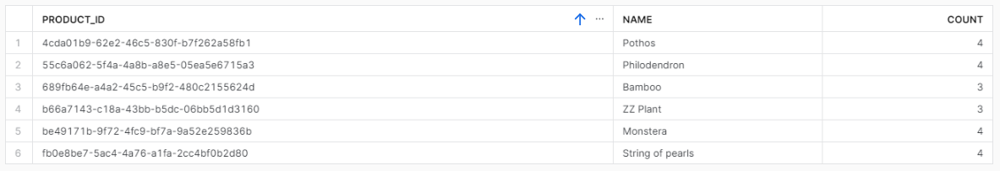
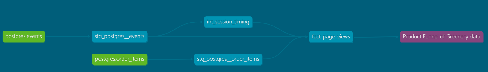

## Part 1
Which products had their inventory change from week 3 to week 4? 

```
select * from 
    DEV_DB.DBT_KRISTINALITAUAUDIBENEDE.products_snapshot
    where dbt_valid_to::date='2023-10-08'
```
A: We had 6 product changes for the following Product Names:
* Pothos
* Philodendron
* Bamboo
* ZZ Plant
* Monstera
* String of pearls

Now that we have 3 weeks of snapshot data, can you use the inventory changes to determine which products had the most fluctuations in inventory? Did we have any items go out of stock in the last 3 weeks? 
```
select product_id, name, count(1) as count 
    from DEV_DB.DBT_KRISTINALITAUAUDIBENEDE.products_snapshot 
    group by 1, 2 
    having count(1)>2;
```


## Part 2
How are our users moving through the product funnel?
```
select
    count(distinct case when page_views>0 then session_id end) as page_views,
    count(distinct case when add_to_carts>0 then session_id end) as add_to_carts,
    count(distinct case when checkouts>0 then session_id end) as checkouts
from DEV_DB.DBT_KRISTINALITAUAUDIBENEDE.FACT_PAGE_VIEWS;
```

PAGE_VIEWS: 578	
ADD_TO_CARTS: 467	
CHECKOUTS: 361
		
Which steps in the funnel have largest drop off points?
A:The drop from page views to add to carst is 19% but the drop from add to carts to checouts is bigger and amounts to 23%

We’ll also want to make sure that any model feeding into this report is defined in an exposure (which we’ll cover in this week’s materials).
Please create any additional dbt models needed to help answer these questions from our product team, and put your answers in a README in your repo.
A: A very simple funnel view: https://app.sigmacomputing.com/corise-dbt/workbook/Dashoard_Funnel-View_Kristina-3TAzyexEJzpwTakV4GDofp

Use an exposure on your product analytics model to represent that this is being used in downstream BI tools. Please reference the course content if you have questions


## Part 3
Benefits:
* it is a great tool to create modular models that can be used across different domains - this way reducing cognitive load and duplication of same logics
* because it can be connected to GitHub we can have version control and revert back to previous models if needed as well as see the course of development for models and understand why things were changed
* it allows developers work on the same model at the same time and finally merge their changes to the master/main branch
* it allows testing for uniqueness, nulls, relationships and other custom requirements
* documentation is a fundament part of building models in dbt
* new things are developed consistently to facilitate model building for analysts (open and active community)

dbt Cloud:
Easy to set up production and push batches of model update swithout having to learn Python to built DAGs in applications like Airflow/Dagster etc.